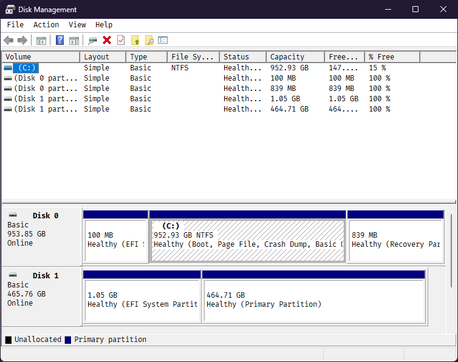

# Unified FileSystems1

## Graduation Project - CSE 495 Preliminary Presentation

> Presented by **Emirhan Altunel**
> Advisor **Dr. Gökhan Kaya**

---

# Project Schema

- We are designing an **API** that will allow multiple hardware devices to be accessed from a single point.
- User can mount our filesystem to their system and can access all the files by using simple commands like `ls`,`cd` or `rm`.

---

<table>
<tr>
    <th>Task</th>
    <th class="date">21.10.24</th>
		<th class="date">28.10.24</th>
		<th class="date">04.11.24</th>
		<th class="date">11.11.24</th>
		<th class="date">18.11.24</th>
		<th class="date">25.11.24</th>
		<th class="date">02.12.24</th>
		<th class="date">09.12.24</th>
		<th class="date">16.12.24</th>
		<th class="date">23.12.24</th>
		<th class="date">30.12.24</th>
		<th class="date">06.01.25</th>
		<th class="date">13.01.25</th>
  </tr>
  <tr>
    <td>Determine the Library/Language</td>
		<td class="full"/>
		<td class="meet" rowspan="9"> Meeting</td>
		<td colspan="5"/>
		<td class="meet" rowspan="9"> Meeting</td>
		<td colspan="4"/>
		<td class="meet" rowspan="9"> Meeting</td>
  </tr>
  <tr>
    <td>Determine the Requirements</td>
		<td class="full"/>
  </tr>
	<tr>
		<td>Implement the basic functions Like writeChunk readChunk</td>
		<td/>
		<td class="full" colspan="2"/>
	</tr>
	<tr>
		<td>Implement the file and folder  abstraction</td>
		<td/>
		<td/>
		<td class="full" colspan="2"/>
	</tr>
	<tr>
		<td>Implement the encryption</td>
		<td/>
		<td colspan="3"/>
		<td class="full"/>
	</tr>
	<tr>
		<td>File placement optimization  depends on file type and disk type</td>
		<td/>
		<td colspan="4"/>
		<td class="full"/>
	</tr>
	<tr>
		<td>Gui for the user when combining multiple disks</td>
		<td/>
		<td colspan="5"/>
		<td class="full"/>
	</tr>
	<tr>
		<td>Performance testing and bug fixing</td>
		<td/>
		<td colspan="5"/>
		<td class="full" colspan="2"/>
	</tr>
	<tr>
		<td>Implementing potential features like multi-platform</td>
		<td/>
		<td colspan="5"/>
		<td colspan="2"/>
		<td class="full" colspan="2"/>
	</tr>

</table>

---

# Project Desing Plan

---

# Requirements for the project

- I should develop a **Disk Management System** that will allow to write/read a chunk to destination independent of the type of the disk. I am planning to support Disks, Media Devices(USB), Partition of Disks and Binary Files in another filesystem.
- I should develop a **File Folder Abstraction** that will allow to create, delete, ... operations on files and folders.
- I should develop a **Encryption System** that will allow to encrypt a chunk of data before writing to the disk and decrypt it after reading from the disk.
- I should add a **File Placement Optimization** that will allow to place the files in the disk according to the file type/size and disk type. For example, small files should be placed in faster drives, and large files should be placed in slower and larger drives.
- I should develop a **Combine Helper** that will help to combine multiple disks to a single disk. I am planning to add a simple GUI for this operation.
- I should write functions for kernel calls.

---

# Project Requirements - 2

- To develop a **Disk Management System**, i could use low-level disk operations like `read` and `write` operations. I could use syscalls directly. So i should use low-level languages like `C` or `C++`.
- To answer kernel calls from user-level, i should use a library like `libfuse` or `Dokany`. Currently, i am focusing on linux, so i will use `libfuse`.
- To develop a simple GUI, i could use `Qt` or `GTK`. I will use `Qt` because it is more user-friendly and has more documentation.
- To develop a **File Folder Abstraction**, i am planning to use a simple tree structure.

---

# Success Criteria

- There must not be any data loss.
- The system should be able to handle multiple disks.
- The system is not responsible for the data loss if the user removes the disk while writing to the disk. But could detect the error and inform the user.
- The system should work asynchronically. There could be multiple read/write operations at the same time.
- The bloat of the system should be minimal. The system should be able to run on a low-end system.
- Encryption should be secure. Without the key, the data should not be readable or overwriteable.
- Files of the same folder could be placed in different disks. The system should be able to handle this situation.
- Chunks of same file could be placed in different disks. The system should be able to handle this situation.
- The system should be independent of the disk type. The system should be able to handle SSD, HDD, USB, and other disk types.
- The system use less memory and disk space as possible.
- If an operation cancels or fails, the system should be able to handle this situation.
- The system should work UNIX-like systems. And could answer any kernel calls.

---

# Comparison of alternative libraries

| Feature                         | **libfuse**                 | **Dokany**      | **WinFsp**      | **OSXFUSE**                 |
| ------------------------------- | --------------------------- | --------------- | --------------- | --------------------------- |
| **User-Space Implementation**   | Yes                         | Yes             | Yes             | Yes                         |
| **Multi-Drive Support**         | Yes                         | Yes             | Yes             | Yes                         |
| **Encryption Support**          | Yes (custom implementation) | No              | No              | Yes (custom implementation) |
| **Platform**                    | Linux                       | Windows         | Windows         | macOS                       |
| **API Complexity**              | Moderate                    | Simple          | Moderate        | Moderate                    |
| **Community and Documentation** | Strong                      | Moderate        | Strong          | Moderate                    |
| **Performance**                 | High                        | Moderate        | Moderate        | High                        |
| **Compatibility**               | High                        | Windows-centric | Windows-centric | macOS                       |

---

# Combine Helper GUI Example

Here is an image of Windows Disk Management. I am planning to develop a similar GUI for combining multiple disks

